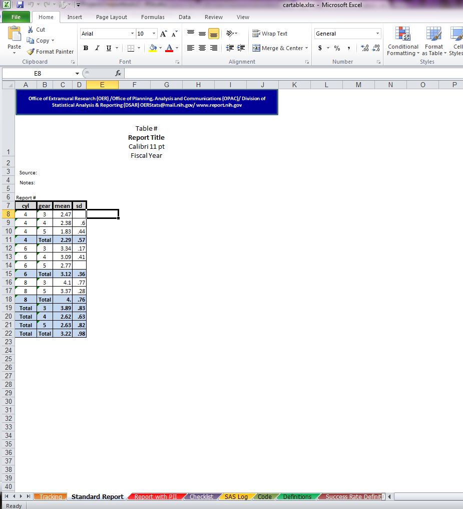

<style type="text/css">
body {
padding-left: 100px;
padding-right: 100px;
}
</style>


The `rreporttools` Package and More Resources
========================================================

Introduction and Installation
---------------------------------------
The goal of this package is to provide a set of tools to make analysts' lives easier. I've written a set of functions that I found to be helpful in performing common reporting tasks. These tasks include reading data from a database, performing simple analyses on a large number of subsets of the data, writing to/reading from MS Excel, and creating [Shiny Applications](http://www.rstudio.com/shiny). 

My aim is for this package is to get analysts who are not experienced in `R` to use it regularly, thereby gaining experience. If you find these tools useful and they make your reporting life easier, I encourages you to learn more about `R` so that you can improve this package even further. 

Using these basic tools requires some introductory knowledge of how to use `R`. I assume for the moment that you have [R](http:///cran.r-project.org) and [R Studio](http://www.rstudio.com) installed on your computer. If not, go submit a ticket, and tell the IT person that open-source software is nothing to fear. (Aside: calling `R` "freeware" is offensive to the hundreds of developers and thousands of users. )

To get started, I strongly recommend reading [R for Beginners](http://cran.r-project.org/doc/contrib/Paradis-rdebuts_en.pdf). Even if you have used `R` before, you should read it, it's short and you might learn something new. For links to more detailed courses and reference material, see the table at the end of this document. 

All set? Good, to install the `rreporttools` package, run the following commands:


```r
depends <- c("devtools", "knitr", "xlsx", "data.table", "plyr", "RJDBC", "reshape2", 
    "shiny")
willinstall <- sapply(depends, function(x) !x %in% rownames(installed.packages()))
if (sum(willinstall) > 0) install.packages(depends[willinstall])

library(devtools)
install_github("rreporttools", "sachsmc")
```


If you get an error, the most likely cause is a mismatch of the Java and `R` architechtures. Chances are, you only have 32-bit Java installed, therefore you must run 32-bit `R` in order to use Java. To change this, go to Tools > Options and __Change the R version__, then restart Rstudio. If you have further problems with rJava, see this link [help with rJava](https://stackoverflow.com/questions/7019912/using-the-rjava-package-on-win7-64-bit-with-r?rq=1).

Load the package and check for errors.

```r
library(rreporttools)
```

```
## Loading required package: xlsx
## Loading required package: rJava
## Loading required package: xlsxjars
## Loading required package: data.table
## Loading required package: plyr
## Loading required package: RJDBC
## Loading required package: DBI
## Loading required package: reshape2
## Loading required package: shiny
```


Reading data into `R`
-----------------------------------------------------

The first step to doing an analysis in `R` is getting the necessary data loaded. Typically, we need to load data from a database of some kind. `rreporttools` includes several functions to make that possible. These depend heavily on the [RJDBC package](http://cran.r-project.org/web/packages/RJDBC/index.html). 

To connect to an Oracle database using Java, you must find the path to the Oracle Java Database Connection (ojdbc) driver on your computer. On Windows, search for "ojdbc6.jar" from the start menu. Then tell the `JDBC` function where it is located. Finally, tell `R` what character to use for quoting. By convention, Oracle uses the single quote `"'"`. The following works on my computer for creating the driver object. 


```r
drv <- JDBC(driverClass = "oracle.jdbc.OracleDriver", classPath = "C:/app/OITDSKADM/product/11.2.0/client_1/jdbc/lib/ojdbc6.jar", 
    identifier.quote = "'")
```


Once you have the driver set up, connecting to the database requires a particular server string. The following works for creating a connection object:

```r
conn <- dbConnect(drv, "jdbc:oracle:thin:@hostname:port:tablename", user = "your_username", 
    pass = "your_password")
```


Test out your connection!


```r
test <- mydbGetQuery(conn, "select * from all_tables", key = "owner")
```


Don't forget to disconnect when you are done!


```r
dbDisconnect(conn)
```


If you have some existing SQL queries in a sas file or in a .sql file, you can use this function to automatically convert them into `R` queries and optionally returning the results as data frames. See the help file for more information. This is experimental, so check your results carefully!


```r
convertSASQuery("mySasCode.sas", "your_username", "your_password", submit = FALSE)
```


In `R`, a SQL query is simply a character object. Therefore, the variety of string manipulation tools in `R` are at your disposal to dynamically and programmatically modify SQL queries. Try doing that in SAS! For example, let's say we want to pull the tables that are owned by a specified user. First lets connect to an example database.


```r
conn <- dbConnect(drv, "somewhere", user = myUsername, pass = myPassword)
```


Now let's create a skeleton query, that we will then modify to specify the owner:


```r
skelQuery <- "select owner, table_name from all_tables where owner = '%s'"
```


The `%s` is a placeholder for a string. We will use the `sprintf` function to replace that placeholder with the desired user:


```r
modQuery <- sprintf(skelQuery, "myusername")
mydbGetQuery(conn, modQuery, key = "table_name")
```


Pretty cool! You can imagine creating a simple function that returns tables owned by the specified user:


```r
tablesOwnedBy <- function(user) {
    
    modQuery <- sprintf("select owner, table_name from all_tables where owner = '%s'", 
        user)
    mydbGetQuery(conn, modQuery)
    
}
```


This is a simple example, but there are many useful applications of this concept. For instance, loop through a long list of names and dynamically create queries to search the table using the `like` statement. Close matches were automatically returned. It saved me a ton of manual searching and copy-pasting. Think about how you could use this technique in one of your recent reports. 

Don't forget to disconnect!

```r
dbDisconnect(conn)
```

```
## Error: error in evaluating the argument 'conn' in selecting a method for function 'dbDisconnect': Error: object 'conn' not found
```


The Split $\rightarrow$ Apply $\rightarrow$ Combine model for Reporting
--------------------------

The split/apply/combine approach is nothing new, but it was made useful and easy to do in `R` by [Hadley Wickham](http://vita.had.co.nz/) with the `plyr` package. The following links will get you up to speed:

  - [homepage for plyr](http://plyr.had.co.nz/)
  - [short presentation](http://www.cerebralmastication.com/wp-content/uploads/2009/10/r-plyr-20091029.pdf)

This package extends `plyr` by additionally computing sub-totals and totals. The same thing can be acheived with the `data.table` package, but faster and with a different syntax. See the functions `ddplyWithTotals` and `DTplyWithTotals` for usage and examples. A brief example is given below.

First examine the `mtcars` dataset, which is a famous data set that has the results of Motor Trends car road tests. It should be loaded automatically when you start `R`. If not, run `data(mtcars)`.


```r
head(mtcars)
```

```
##                    mpg cyl disp  hp drat    wt  qsec vs am gear carb
## Mazda RX4         21.0   6  160 110 3.90 2.620 16.46  0  1    4    4
## Mazda RX4 Wag     21.0   6  160 110 3.90 2.875 17.02  0  1    4    4
## Datsun 710        22.8   4  108  93 3.85 2.320 18.61  1  1    4    1
## Hornet 4 Drive    21.4   6  258 110 3.08 3.215 19.44  1  0    3    1
## Hornet Sportabout 18.7   8  360 175 3.15 3.440 17.02  0  0    3    2
## Valiant           18.1   6  225 105 2.76 3.460 20.22  1  0    3    1
```


Now suppose you want to compute the average car weight by number of cylinders and number of gears. With `plyr` it's easy.


```r
library(plyr)
ddply(mtcars, ~cyl + gear, function(df) data.frame(mean_wt = mean(df$wt)))
```

```
##   cyl gear mean_wt
## 1   4    3   2.465
## 2   4    4   2.378
## 3   4    5   1.827
## 4   6    3   3.337
## 5   6    4   3.094
## 6   6    5   2.770
## 7   8    3   4.104
## 8   8    5   3.370
```


We can do the same thing with the `data.table` package, but note that the by variables must be converted to factors first.


```r
mtcars2 <- data.table(mtcars, key = c("cyl", "gear"))
mtcars2[, `:=`(cyl, as.factor(cyl))]
mtcars2[, `:=`(gear, as.factor(gear))]
```


```r
mtcars2[, list(mean_wt = mean(wt)), by = c("cyl", "gear")]
```

```
##    cyl gear mean_wt
## 1:   4    3   2.465
## 2:   4    4   2.378
## 3:   4    5   1.827
## 4:   6    3   3.337
## 5:   6    4   3.094
## 6:   6    5   2.770
## 7:   8    3   4.104
## 8:   8    5   3.370
```

Now, lets say we want to add the total. 


```r
## ddplyWithTotals(mtcars, ~cyl + gear, function(df) data.frame(mean_wt = mean(df$wt)))
DTplyWithTotals(mtcars2, c("cyl", "gear"), list(mean_wt = mean(wt)))
```

```
##       cyl  gear mean_wt
##  1:     4     3   2.465
##  2:     4     4   2.378
##  3:     4     5   1.827
##  4:     4 Total   2.286
##  5:     6     3   3.337
##  6:     6     4   3.094
##  7:     6     5   2.770
##  8:     6 Total   3.117
##  9:     8     3   4.104
## 10:     8     5   3.370
## 11:     8 Total   3.999
## 12: Total     3   3.893
## 13: Total     4   2.617
## 14: Total     5   2.633
```

Options allow for grand totals. 


```r
ddplyWithTotals(mtcars, ~cyl + gear, function(df) data.frame(mean_wt = mean(df$wt)), 
    grandTotal = TRUE)
```

```
##      cyl  gear mean_wt
## 1      4     3   2.465
## 2      4     4   2.378
## 3      4     5   1.827
## 4      4 Total   2.286
## 5      6     3   3.337
## 6      6     4   3.094
## 7      6     5   2.770
## 8      6 Total   3.117
## 9      8     3   4.104
## 10     8     5   3.370
## 11     8 Total   3.999
## 12 Total     3   3.893
## 13 Total     4   2.617
## 14 Total     5   2.633
## 15 Total Total   3.217
```

```r
## DTplyWithTotals(mtcars2, c("cyl", "gear"), list(mean_wt = mean(wt)), grandTotal = TRUE)
```


The `nestedOnly` option computes totals only for values nested within the outermost values. This is important as an option when there are three or more by variables.


```r
ddplyWithTotals(mtcars, ~cyl + gear, function(df) data.frame(mean_wt = mean(df$wt)), 
    nestedOnly = TRUE)
```

```
##    cyl  gear mean_wt
## 1    4     3   2.465
## 2    4     4   2.378
## 3    4     5   1.827
## 4    4 Total   2.286
## 5    6     3   3.337
## 6    6     4   3.094
## 7    6     5   2.770
## 8    6 Total   3.117
## 9    8     3   4.104
## 10   8     5   3.370
## 11   8 Total   3.999
```

```r
## DTplyWithTotals(mtcars2, c("cyl", "gear"), list(mean_wt = mean(wt)), nestedOnly = TRUE)
```

The results here are the same, but for large data sets, you will need to use `DT`. However, `DT` requires the `by` variables to be factors, while `ddply` can deal with numeric variables. 

Writing tables into Excel templates
--------------------------------

If you do nothing else with `R`, I encourage you to use the automatic output and formatting functions that I've provided. This package includes an example template template, and can output a data frame to it with the appropriate formatting. Here is a quick example using the mtcars dataset.


```r
cartable <- ddplyWithTotals(mtcars, ~cyl + gear, function(df) data.frame(mean_wt = mean(df$wt), 
    sd_wt = sd(df$wt)), grandTotal = TRUE)

mywb <- formatDataFrame(df = cartable, wb = NULL, outputFile = "cartable.xlsx", 
    freezeFrame = FALSE, styleList = c("textStyle", "textStyle", "numberStyle", 
        "numberStyle"), save = FALSE)
mywb2 <- formatTotals(mywb, cartable, styleLookup = c("textStyle", "textStyle", 
    "numberStyle", "numberStyle"), sheet = 2, sr = 7)

saveWorkbook(mywb2, file = "cartable.xlsx")
```

Run it for yourself and check out the results. Additional format types are available, see the `formatDataFrame` help file for more details.



Writing Shiny Applications
-------------------------------------

To get started writing your own shiny app, we provide a skeleton app with an intialization function `authorShiny`. Give the function a folder name, and it will create the skeleton app, run it, and open the files that you will need to edit to customize your app. Try it out:


```r
authorShiny("myApp")
```


Details on authoring shiny apps are beyond the scope of this vignette. A good place to get started is with the [shiny tutorial](http://rstudio.github.io/shiny/tutorial/). For help, [email me](mailto:michael.sachs@nih.gov), or go to the [google groups page for shiny](https://groups.google.com/forum/#!forum/shiny-discuss). Interactive graphics can be achieved in various ways, but I have been using [d3.js](http://d3js.org/).

Additional Resources
-------------------------------------------
This barely scratches the surface of what you can do with `R`, but hopefully it demostrates that `R` is very useful for creating accurate and reproducible reports. Additional reading for learning about `R` is in the table below. When in doubt, read the help files!

Topic | Type | Link
-----|---|---
__Introductory `R`__ | | 
 | Quick Intro | http://cran.r-project.org/doc/contrib/Paradis-rdebuts_en.pdf
 | Google Dev's `R` Tutorial | http://www.youtube.com/playlist?list=PLOU2XLYxmsIK9qQfztXeybpHvru-TrqAP
 | Impatient `R` | http://www.burns-stat.com/documents/tutorials/impatient-r/
__General `R` Reference__ | | 
  | Summer Course  | http://faculty.washington.edu/kenrice/rintro/index.shtml
 | Reference | http://cran.r-project.org/doc/manuals/r-release/R-intro.html
 | Web Reference | http://www.cookbook-r.com/
 | List of Resources | http://cran.r-project.org/other-docs.html
__More Advanced `R`__ |  | 
 | How to Make Documents Like This | https://support.rstudio.com/hc/en-us/articles/200552086-Using-R-Markdown
 | The `R` Inferno | http://www.burns-stat.com/pages/Tutor/R_inferno.pdf
 | Hadley Wickham's Advanced `R` Book | http://adv-r.had.co.nz/
__`plyr`__ |  | 
 | Homepage | http://plyr.had.co.nz/
  | Paper | http://www.jstatsoft.org/v40/i01
  | Presentation | http://www.cerebralmastication.com/wp-content/uploads/2009/10/r-plyr-20091029.pdf
  | Presentation | http://streaming.stat.iastate.edu/workshops/r-intro/lectures/6-advancedmanipulation.pdf
  __`data.table`__ | | 
  | Intro | http://datatable.r-forge.r-project.org/datatable-intro.pdf
  | Reference | http://datatable.r-forge.r-project.org/datatable-faq.pdf
  | Presentation | http://datatable.r-forge.r-project.org/CologneR_2013.pdf
__`xlsx`__ | | 
 | Home page | https://code.google.com/p/rexcel/
 | Intro | http://cran.r-project.org/web/packages/xlsx/vignettes/xlsx.pdf
__`shiny`__ | | 
   | Home page | https://www.rstudio.com/shiny 
   | Tutorial | http://rstudio.github.io/shiny/tutorial/
   | Layouts | https://github.com/rstudio/shiny/wiki/Shiny-Application-Layout-Guide
   | Support Group | https://groups.google.com/forum/#!forum/shiny-discuss
__D3__ |  |
 | Home page | http://d3js.org/
 | List of Tutorials | https://github.com/mbostock/d3/wiki/Tutorials
 | Intro | http://alignedleft.com/tutorials/d3/
__`R` Opinion__ | | 
 | Problems with Spreadsheets | http://www.burns-stat.com/documents/tutorials/spreadsheet-addiction/
 | Why use `R` | http://thetarzan.wordpress.com/2011/07/15/why-use-r-a-grad-students-2-cents/
